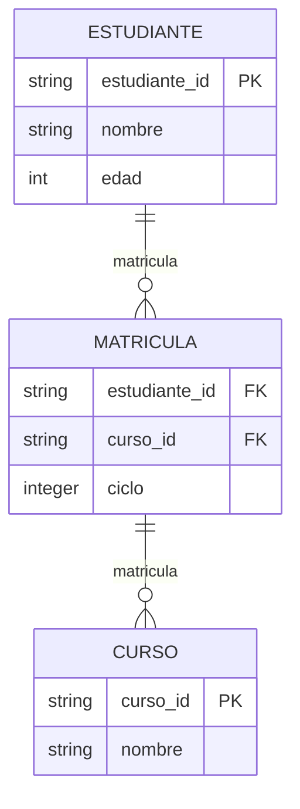

# Recopilación y almacenamiento de datos

El análisis de datos comienza con la recopilación de datos. Podríamos separar la recopilación en dos grandes paradigmas:

- **Procesamiento por lotes** (*batch processing*): consiste en la recolección de una gran cantidad de datos históricos, típicamente una sola vez, o con una frecuencia tan baja que cada recopilación tiene una gran cantidad de datos. Ejemplos: los "famosos" datos de pasajeros del Titanic (necesariamente recolectados una sola vez) o la información que utiliza YouTube o Netflix para entrenar sus sistemas de recomendaciones, que son actualizados aproximadamente cada 24 horas pero que contienen millones de interacciones.
- **Procesamiento en tiempo real** (*real-time processing*): consiste en la recolección de datos al momento de su ocurrencia, esto es, basado en eventos (*event-driven*) o con una frecuencia de recopilación tan alta que solamente algunos pocos nuevos datos, o ninguno, son obtenidos en cada muestreo. Ejemplos: datos sobre terremotos, mercados de valores o de redes de sensores recopilados cada 10 segundos.

En medio de ambos hay una "zona gris" a menudo llamada **procesamiento en tiempo casi real** (*quasi real-time processing*) que captura la dinámica del sistema sin responder directamente a eventos o a una altísima frecuencia. Ejemplos: telemetría y rastreo en vehículos de transporte público, que actualizan datos cada 15 o 20 segundos, lo suficiente para tener una buena estimación de la posición, pero no totalmente "en tiempo real".

La definición varía según el fenómeno analizado, que puede tener cambios muy frecuentes o no.

!!! note "Definición informal de procesamiento en tiempo real" 
    Un flujo de datos en el cual el procesamiento de una nueva muestra es iniciado en el momento de su llegada y concluye antes de la llegada de la siguiente muestra o evento.

### ¿Y de dónde vienen estos datos?

A veces de un solo archivo (ejemplo, un `.xlsx` o `.csv`), a veces directamente de un sensor (ejemplo, un Arduino con un sensor de temperatura conectado a nuestra computadora), a veces de una base de datos externa, siguiendo varios *modelos de comunicación* posibles.

#### Modelos de comunicación

Algunos de los modelos de comunicación para compartir datos entre sistemas son:

- **Solicitud/respuesta**: donde una *solicitud* del *cliente* interactúa con los *recursos* del *servidor* que devuelve una *respuesta*. Ejemplo: HTTP (404 Not Found) y los web API (sobre HTTP) que conectan distintos servicios. 
- **Publicación/suscripción**: donde un *productor* *publica* un *mensaje* que coloca en un *canal* sobre un *tópico* y un *intermediador de mensajes* lo distribuye a todos los procesos que estén *suscritos*. Ejemplo: el monitoreo de eventos en la agricultura de precisión en una red de sensores conectada con [MQTT](https://mqtt.org/). 
- **WebSockets**: donde hay un canal *permanente* de comunicación *bidireccional*. Ejemplo: cualquier aplicación de chat (WhatsApp, Telegram, etc.) o videojuegos en línea.
- Otros

Una de las soluciones más populares es, precisamente, obtener datos de fuentes externas, y hacerlo por medio de una interfaz de programación de aplicaciones (API).

### ¿Dónde son almacenados los datos?

Luego, el análisis de datos típicamente continúa con el almacenamiento de datos después de la recopilación. Las bases de datos ofrecen almacenamiento permanente y son la solución necesaria en el caso de grandes cantidades de datos.

Nota: no siempre es necesario almacenar los datos de esta forma. A menudo es suficiente hacer el análisis de los datos y luego descartarlos.

Hay distintos tipos de bases de datos, donde las bases de datos relacionales son las más comunes.

#### Bases de datos relacionales

Son datos *tabulares* -y por tanto "planos" y "no anidados"- en tablas con columnas, también llamadas *campos* (*fields*), y filas, también llamadas *registros* (*records*). Cada tabla tiene una *llave primaria* (PK, *primary key*) que identifica de forma única cada registro. Las tablas están relacionadas entre sí (de ahí el nombre *relacional*) con *llaves foráneas* (FK, *foreign key*) que hacen referencia a un registro de otra tabla, creando una estructura lógica entre las tablas de una misma base de datos.

En el siguiente *diagrama entidad-relación* (ERD) simplificado, una tabla tiene tres columnas con datos de estudiantes, otra tabla tiene datos de los cursos y una tercera tabla que vincula cursos con estudiantes (relación muchos-a-muchos, *many-to-many*) con llaves foráneas a las dos tablas anteriores.



Las bases de datos relacionales más conocidas son tipo SQL (*Structured Query Language*), que utilizan un lenguaje especial para hacer consultas a la base de datos. Por ejemplo:

```sql
SELECT nombre, edad FROM estudiantes WHERE id = B00000;
```

devuelve los datos (nombre, edad) del carné B00000.

En general, las bases de datos tienen *transacciones* del tipo: lectura, creación, actualización y eliminación de registros (CRUD, *Create, Read, Update, Delete*).

Los sistemas de administración de bases de datos (DBMS, *Data Base Management System*) más populares son PostgreSQL, SQLite3, MySQL, MariaDB, Oracle y otros.

## ¿Qué haremos en el proyecto?

Para este proyecto haremos una recopilación de datos en **tiempo *casi* real** de fuentes externas con un **Web API** y lo haremos de forma periódica, utilizando un administrador y planificador de tareas, para almacenarlos en una **base de datos relacional**.

A continuación hay una ampliación de estos conceptos.

### Datos desde fuentes externas con API

En el **PyX** [número 6](https://github.com/fabianabarca/python) hay una explicación más amplia sobre los Web API y el uso del paquete `requests` de Python.

Hay una gran cantidad de API públicos disponibles en [Public APIs](https://publicapis.dev/).

### Recolección periódica de datos con un planificador de tareas

En Python es posible utilizar el paquete [Celery](https://docs.celeryq.dev/en/stable/index.html) como administrador de tareas (*task manager*) y como un planificador de tareas (*task scheduler*) que "calendariza" tareas en frecuencias especificadas como "cada 60 segundos" o según otros criterios, como "el primer lunes del mes" o "al anochecer".

Por tanto, para un flujo de procesamiento de datos en tiempo real o en tiempo *casi* real podemos usar Celery para recopilar datos de forma continua y periódica. Hay más detalles a continuación.

### Administrador de tareas

Celery Worker administra la ejecución de tareas de forma asincrónica entre los "trabajadores" (*worker*) disponibles. Un "trabajador" puede ser simplemente un núcleo de la computadora local que está libre para ejecutar una tarea o puede ser un servidor remoto en una configuración más compleja, por ejemplo.

"Asincrónico" significa que las tareas no bloquean unas a otras. Por ejemplo: en un flujo "sincrónico" de tareas, una tarea es ejecutada solamente hasta que la anterior haya sido terminada. En el contexto de un administrador de tareas como Celery Worker, un flujo de tareas asincrónico permite que múltiples tareas sean ejecutadas en paralelo, sin esperar a que las tareas anteriores estén completas. Celery Worker estará a cargo de "vigilar" la cola de ejecución de las tareas y reportar sus resultados.

#### Planificador de tareas

Con Celery Beat podemos definir los momentos en que las tareas son ejecutadas. Esto es útil para crear tareas periódicas, en un periodo de tiempo definido como "cada 15 segundos" o "cada 12 horas" o "todos los días a las 2:00 am" o "el segundo miércoles de cada mes", e inclusive con base en eventos solares, como "al amanecer" o "al mediodía" (que varía según la ubicación en el planeta y la época del año).

#### Intermediador de mensajes

Cuando es necesaria la comunicación entre procesos en una computadora, es necesario un **intermediador de mensajes** (*message broker*) para entregar el mensaje, pues los procesos no pueden comunicarse entre sí directamente.

[Redis](https://redis.io/) es un intermediador de mensajes popular que permite varios modelos de comunicación, como publicación/suscripción. 

Redis tiene integración con Celery, y es necesario para el envío de la asignación de las tareas periódicas.

### Bases de datos e interfaces ORM

El uso de bases de datos es un área compleja y especializada, sin embargo, hay herramientas en Python que facilitan su gestión.

En particular, la recomendación es utilizar un mapeador relacional de objetos (ORM, *Object-Relational Mapping*), que representa las tablas y sus datos como una *clase* en un lenguaje de programación, habilitando la interacción con la base de datos con el paradigma orientado a objetos, y abstrayendo la especificidad de distintas bases de datos utilizadas.

En Python existe SQLAlchemy, un poderoso paquete para interactuar con los DBMS más populares.

El ejemplo de la tabla de datos de estudiantes, cursos y matrícula mostrados anteriormente, puede ser implementado de la siguiente forma.

```python
from sqlalchemy import create_engine, Column, ForeignKey, Integer, String
from sqlalchemy.ext.declarative import declarative_base
from sqlalchemy.orm import sessionmaker

# Crear la clase base de cada tabla
Base = declarative_base()


# Definir los modelos
class Estudiante(Base):
    __tablename__ = "estudiantes"

    estudiante_id = Column(String, primary_key=True)
    nombre = Column(String)
    edad = Column(Integer)


class Curso(Base):
    __tablename__: = "cursos"

    curso_id = Column(String, primary_key=True)
    nombre = Column(String)


class Matricula(Base):
    __tablename__ = "matriculas"

    estudiante_id = Column(String, ForeignKey("estudiantes.estudiante_id"), primary_key=True)
    curso_id = Column(String, ForeignKey("cursos.curso_id"), primary_key=True)
    ciclo = Column(Integer, primary_key=True)

    # Define the relationship to Estudiante and Curso
    estudiante = relationship("Estudiante")
    curso = relationship("Curso")
```

Aquí fueron creadas las tres tablas, donde `matriculas` hace referencia por medio de llaves foráneas a las llaves primarias `estudiantes.estudiante_id` y `cursos.curso_id`. En esta misma tabla nótese también que las tres columnas tienen `primary_key=True`, lo que indica una *llave primaria compuesta*, para lo cual cada registro debe tener una *combinación única* de estudiante, curso y ciclo lectivo.

Finalmente, hay que crear las tablas estableciendo un `engine` o referencia a la base de datos a utilizar (en este caso SQLite3) y crear una sesión ligada a ese `engine`, para poder ejectuar las transacciones deseadas.

```python
# Crear la conexión a la base de datos SQLite3
engine = create_engine(f"sqlite:///{name}")
Session = sessionmaker(bind=engine)
session = Session()

# Crear la(s) tabla(s) en la base de datos
Base.metadata.create_all(engine)
```

En este proyecto no está determinado un mecanismo fundamental de *migraciones*, que son necesarias para el caso, completamente usual, en el que hay que realizar una actualización en la base de datos cuando hay cambios en los modelos (*clases*), conservando al mismo tiempo los datos ya almacenados. Por ejemplo, para cambiar el tipo de dato de `estudiante_id` de `String` a `Integer` hay que hacer una migración. [Alembic](https://alembic.sqlalchemy.org/en/latest/) es la forma de hacerlo con SQLAlchemy, pero no está dentro de los alcances del proyecto.

Para el proyecto la recomendación es utilizar SQLite o PostgreSQL. Una diferencia básica entre ambos es que SQLite3 existe como un archivo binario (por ejemplo, `db.sqlite3` o `data.db`) mientras que PostgreSQL es un programa propiamente, instalado en la computadora o servidor. Para proyectos de gran escala PostgreSQL es recomendado, sin embargo SQLite3 tiene capacidad para manejar cientos de millones de datos, así que en nuestro proyecto no es un problema. Quizá hay que tener más cuidado de no borrar el archivo "de un dedazo".
